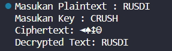
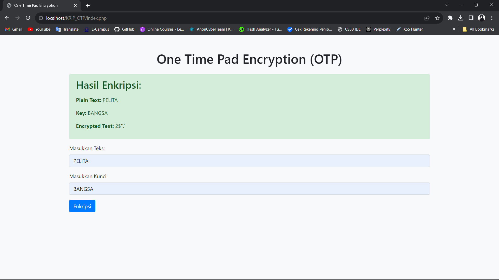

# Tugas Kriptografi
### Profil
| #               | Biodata           |
| --------------- | ----------------- |
| **Nama**        | Bilal AlHafidz    |
| **NIM**         | 312110397         |
| **Kelas**       | TI.21.A1          |
| **Mata Kuliah** | Kriptografi       |

# Enkripsi One Time Pad (OTP)

### Gambaran Umum

Tugas ini menunjukkan implementasi algoritma enkripsi One Time Pad (OTP) menggunakan dua bahasa pemrograman: Python dan PHP. OTP adalah algoritma kunci simetris yang dikenal karena keamanannya ketika digunakan dengan kunci yang benar-benar acak sepanjang pesan yang dienkripsi. Tugas ini juga mencakup implementasi dalam Python dan PHP untuk menunjukkan fleksibilitas OTP di berbagai bahasa.

## Files

1. **main.py** (Implementasi Python)
   - Bertanggung jawab untuk mengonversi string menjadi ASCII, melakukan operasi XOR, dan menangani enkripsi dan dekripsi menggunakan OTP.
   
2. **encryption_functions.php** (Implementasi PHP)
   - Mengimplementasikan fungsi untuk mengonversi string menjadi ASCII, melakukan operasi XOR, dan menangani enkripsi menggunakan OTP di PHP.

3. **index.php** (Antarmuka Web)
   - Menyediakan antarmuka web sederhana untuk pengguna memasukkan teks dan kunci, kemudian melakukan enkripsi OTP dan menampilkan hasilnya.

## Cara Penggunaan

### Implementasi Python (main.py)

1. Jalankan skrip `main.py`.
2. Masukkan teks biasa dan kunci ketika diminta.
3. Skrip akan menampilkan teks sandi dan teks terdekripsi.

   

### Implementasi PHP (encryption_functions.php)

1. Sertakan `encryption_functions.php` dalam project PHP.
2. Panggil fungsi `encryptOTP`, lewatkan teks biasa dan kunci sebagai parameter.
3. Fungsi akan mengembalikan teks terenkripsi.

### Antarmuka Web (index.php)

1. Terapkan file `index.php` di server web.
2. Buka halaman web di browser.
3. Masukkan teks dan kunci dalam formulir dan kirim.
4. Teks terenkripsi akan ditampilkan di halaman.

   

## Catatan Penting

- Pastikan kunci yang digunakan benar-benar acak dan sepanjang pesan.
- Tugas ini ditujukan untuk tujuan pendidikan dan mungkin tidak cocok untuk penggunaan produksi tanpa peningkatan lebih lanjut.
- Gunakan HTTPS saat menerapkan antarmuka web untuk komunikasi yang aman.

Jangan ragu untuk menjelajahi dan memodifikasi kode untuk pembelajaran dan eksperimen. Selamat coding!

### Terima Kasih!